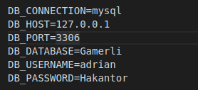

## Proyecto:
- Nuestro proyexto es una web para gestionar los videojuegos en listas, incluye rankings y un sistema de amigos Carlos, Adrian.

## Intalacion:
1. Descargar el repositorio del Github (git clone 'nombre del repositorio')
2. Una vez instalado;
3. Creas una base de datos.
4. Comprovar que existe el fichero (.env) si no lo creas copias el .env.exemple y modificas (DB_DATABASE,DB_USERNAME,DB_PASSWORD).
5. 
6. Hacer un "composer install" dentro del proyecto (por terminal).
7. Hacer un php artisan key:generate dentro del proyecto (por terminal).

## Tecnologias Utilizadas
# framework
- Laravel
# Stilos
- CSS
- Tailwind
- Boostrap
# Codigo
- PHP
- JQuery
- 
## Authors
- Carlos Jurado.
- Adrian Pradas.
